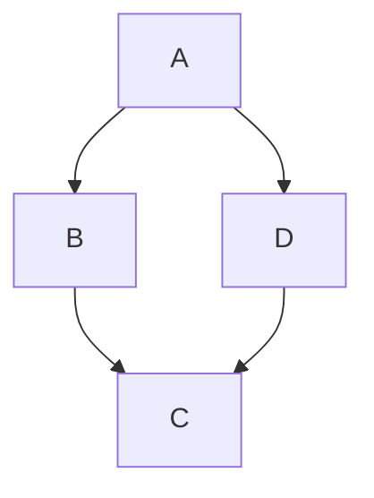

Markdown Characters

Markdown Characters
Gruber’s Markdown
Emphasis
Links
Code
Image
Headers
Lists
Blockquotes
Horizontal Rules
Github Flavored Markdown
Line Breaks
Fenced Code Block
Table (GFM)
Multimarkdown
Haroopad Flavored Markdown
Pharse Emphasis
Horizontal Rules
Table of Content
Math Expression
Media Embed
Diagram (with v0.13)
Tasklist (with v0.13)
Presentation (with v0.13)
PHP Extras Markdown
Footnotes (with v0.12)
\ backslash
` backtick
* asterisk
_ underscore
{ } curly braces
[ ] square brackets
( ) parentheses
# hash mark
+ plus sign
- minus sign (hyphen)
. dot
! exclamation
^ caret
~ tilde
Gruber’s Markdown

Emphasis

Italic - italic

*italic*
Bold - bold

**bold** or __bold__
Links

Inline - link

A [Link](http://example.com "Title")
Reference-style - [link][id]

A [Link][id].

[id]: http://example.com "Title"
Code

A code span

A `code span`
Image

Inline - Image

Alt Text


Reference-style Image

Alt Text.

A ![Alt Text][logo].

[logo]: http://bit.ly/1drEdWK "Title"
Image Style (Haroopad Flavored Markdown)

Alt Text
Alt Text

Alt Text.


![Alt Text][logo].

[logo]: http://bit.ly/1drEdWK "Title" "width:50px"
Headers

Setext-style

Header 1
========

Header 2
--------
atx-style

# Header 1
## Header 2
...
###### Header 6
Lists

Ordered (numbered)

Red
Blue
Green
1. Red
2. Blue
3. Green
Unordered (bulleted)

Red
Blue
Green
* Red
* Blue
* Green

- Red
- Blue
- Green

+ Red
+ Blue
+ Green
Nest Lists

Colors
Red
Blue
Green
Yellow
Dark Yellow
Light Yellow
Green Yellow
* Colors
  1. Red
  2. Blue
  3. Green
  4. Yellow
    - Dark Yellow
    - Light Yellow
    - Green Yellow
Blockquotes

This is the Blockquotes
> This is the **Blockquotes**
Horizontal Rules

Three or more hyphens(-), asterisks(*), or underscores(_)

Page break

* * *
Section break

- - -
Margin break (add margin bottom)

_ _ _
Github Flavored Markdown

Strikethrough - strikethrough

~~strikethrough~~
Line Breaks

End a line with tow or more spaces

Roses are red,
Violets are blue.

Roses are red,  
Violets are blue.
Fenced Code Block

```
var your = 'code here';
```
Syntax Highlight

```[language name]
var your = 'code here';
```
Language names - http://highlightjs.org/static/test.html
Javascript

function syntaxHighlight(a, b) {
    return a + b;
}
#include <iostream>

int main(char *argv[]) {
    return -2e3 + 121;
}
Table (GFM)

name	age	gender	money
rhio	384	robot	$3,000
haroo	.3	bird	$430
jedi	?	undefined	$0
| name  | age | gender    | money  |
|-------|:---:|-----------|-------:|
| rhio  | 384 | robot     | $3,000 |
| haroo | .3  | bird      | $430   |
| jedi  | ?   | undefined | $0     |
Multimarkdown

What is MultiMarkdown?
Superscript - superscript

^superscript^
Subscript - subscript

~subscript~
Underline - underline

++underline++
Haroopad Flavored Markdown

Pharse Emphasis

Highlight - highlight

==highlight==
Horizontal Rules

Sentence break (add margin bottom)

_ _ _
Table of Content

[TOC] or [toc]

[TOC "float:left"]
[TOC "float:right"]
Math Expression

Inline Math expression

x2
$x^2$ or $$x^2$$
Block Math expression


x2
$
x^2
$
Media Embed

This is Block syntax.


@[Alt Text](Content-URL "CSS")

@[Haroopad](https://vimeo.com/70385914 "width:100%;height:350px")
Diagram (with v0.13)

You get more detail mermaid syntax

example


become

A
B
D
C
Tasklist (with v0.13)

This statement is useful when you create the TODO or Checklist.

example

- [ ] first task
- [x] second task is done
- [ ] third task
 first task
 second task is done
 third task
Presentation (with v0.13)

Just insert *** or --- separator to separate each slide.

example

## slide1 title

slide2 content

***

## slide2 title

slide2 content
PHP Extras Markdown

Footnotes (with v0.12)

This is footnote1

explanatory information ↩
This is footnote[^1]

[^1]: explanatory information