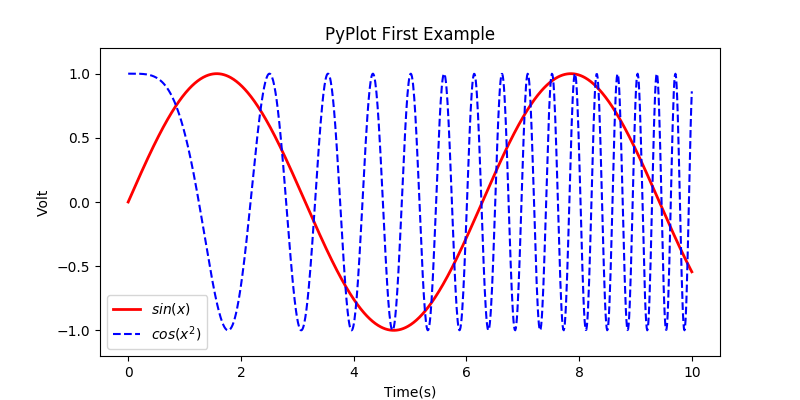

# python安装常用库

[TOC]  

### 1安装wheel  pip 路径:C:\Home\Python\Python27\Scripts

`pip install wheel` 
>Requirement already satisfied: wheel in c:\home\python\python27\lib\site-packages


 检测 wheel 安装是否成功

`pip freeze`

### 2. 安装python的 requests 库

##### 方式一: 使用pip install

`C:\Users\chen>pip install  requests`

>Collecting requests
  Downloading requests-2.14.2-py2.py3-none-any.whl (560kB)
    100% |████████████████████████████████| 563kB 153kB/s
Installing collected packages: requests
Successfully installed requests-2.14.2    


##### 方式二: 使用git 下载request包 ,然后使用python 运行setup.py 安装  

```git
 git clone git://github.com/kennethreitz/requests.git
 cd requests
 python setup.py install
```
 

### 3. 安装python的 numpy 库

`D:\08Git\01python包>pip install "numpy-1.11.3+mkl-cp27-cp27m-win_amd64.whl"`

>Processing d:\08git\01python?\numpy-1.11.3+mkl-cp27-cp27m-win_amd64.whl
Installing collected packages: numpy
Successfully installed numpy-1.11.3+mkl


### 4. 安装scipy

` D:\08Git\01python包>pip install scipy-0.19.0-cp27-cp27m-win_amd64.whl`

>Processing d:\08git\01python?\scipy-0.19.0-cp27-cp27m-win_amd64.whl
Requirement already satisfied: numpy>=1.8.2 in c:\home\python\python27\lib\site-packages (from scipy==0.19.0)
Installing collected packages: scipy
Successfully installed scipy-0.19.0

### 5. 安装Matplotlib :matplotlib-2.0.2-cp27-cp27m-win_amd64.whl (8.6MB)
##### 方式一 使用pip 安装

`pip install Matplotlib`

>D:\08Git\01python包>pip install Matplotlib
Collecting Matplotlib
  Downloading matplotlib-2.0.2-cp27-cp27m-win_amd64.whl (8.6MB)
    100% |████████████████████████████████| 8.6MB 83kB/s
Collecting six>=1.10 (from Matplotlib)
  Downloading six-1.10.0-py2.py3-none-any.whl
Collecting pytz (from Matplotlib)
  Downloading pytz-2017.2-py2.py3-none-any.whl (484kB)
    100% |████████████████████████████████| 491kB 80kB/s
Collecting cycler>=0.10 (from Matplotlib)
  Downloading cycler-0.10.0-py2.py3-none-any.whl
Collecting python-dateutil (from Matplotlib)
  Downloading python_dateutil-2.6.0-py2.py3-none-any.whl (194kB)
    100% |████████████████████████████████| 194kB 54kB/s
Collecting pyparsing!=2.0.4,!=2.1.2,!=2.1.6,>=1.5.6 (from Matplotlib)
  Downloading pyparsing-2.2.0-py2.py3-none-any.whl (56kB)
    100% |████████████████████████████████| 61kB 76kB/s
Requirement already satisfied: numpy>=1.7.1 in c:\home\python\python27\lib\site-packages (from Matplotlib)
Collecting functools32 (from Matplotlib)
  Downloading functools32-3.2.3-2.zip
Building wheels for collected packages: functools32
  Running setup.py bdist_wheel for functools32 ... done
  Stored in directory: C:\Users\chen\AppData\Local\pip\Cache\wheels\3c\d0\09\cd78d0ff4d6cfecfbd730782a7815a4571cd2cd4d2ed6e69d9
Successfully built functools32
Installing collected packages: six, pytz, cycler, python-dateutil, pyparsing, functools32, Matplotlib
Successfully installed Matplotlib-2.0.2 cycler-0.10.0 functools32-3.2.3.post2 pyparsing-2.2.0 python-dateutil-2.6.0 pytz-2017.2 six-1.10.0 


##### 方式二 下载*.whl 使用命令安装
`pip install matplotlib-2.0.2-cp27-cp27m-win_amd64.whl`


### 6. 检测安装状态
`pip freeze` 

>D:\08Git\01python包>pip freeze
cycler==0.10.0
functools32==3.2.3.post2
matplotlib==2.0.2
numpy==1.11.3+mkl
pyflann==1.6.13
pyparsing==2.2.0
python-dateutil==2.6.0
pytz==2017.2
requests==2.14.2
scipy==0.19.0
six==1.10.0


### 7. 说明
###### 1. requests 库可用于抓取网页到本地
```python
import requests
res = requests.get("https://www.baidu.com")
savefile = open("baidu.html","wb")
savefile.write(res.content)
savefile.close() 
```

###### 2. Python安装完Numpy，SciPy和MatplotLib后，可以成为非常犀利的科研利器。
```python
#-*- coding: UTF-8 -*- 
import numpy as np
import matplotlib.pyplot as plt

x = np.linspace(0, 10, 1000)
y = np.sin(x)
z = np.cos(x**2)

plt.figure(figsize=(8,4))
plt.plot(x,y,label="$sin(x)$",color="red",linewidth=2)
plt.plot(x,z,"b--",label="$cos(x^2)$")

plt.xlabel("Time(s)")
plt.ylabel("Volt")

plt.title("PyPlot First Example")

plt.ylim(-1.2,1.2)
plt.legend()
plt.show()

```

> 绘图
 


